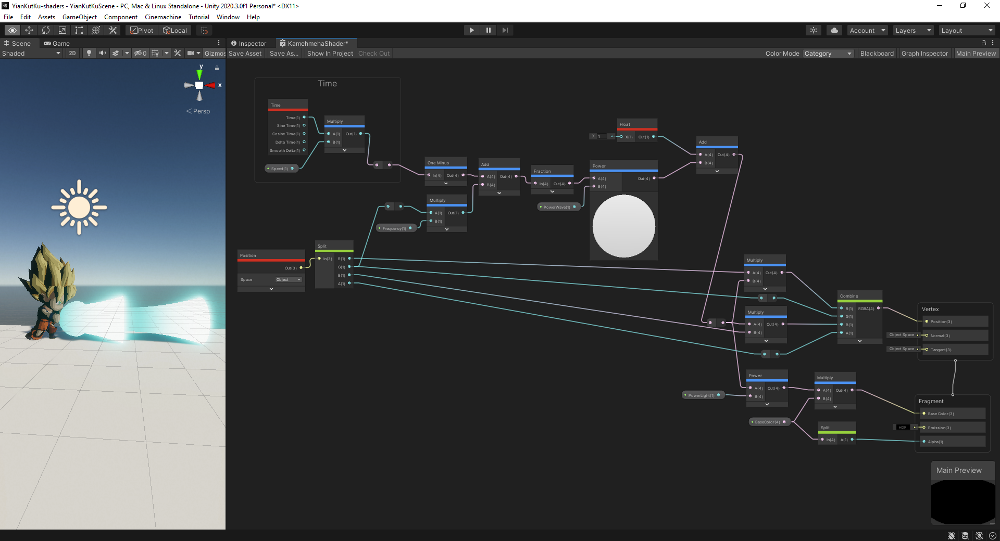

# Shaders
## Requiere 
Au moins Unity3D 2020
(testé uniquement sur  `Unity3D 2020.3f1`) 
## Quick lunch
Clone this repo : 
```bash
git clone https://github.com/Ronan-senpi/Yian-kut-ku-shaders
```
Aller sur unityHub et ouvrir le projet 

## Features

### Shaders Yian kut ku
#### Basic Shadows Shader

### Chubby Shader

#### Cubic Shader

#### Glitch Shader

#### twist Shader

#### Wiggles Shader

#### Toon Shader

### Son goku

#### Kamehameha Shader

Le Kamehameha est une sphère dans laquelle un cylindre a été fusioné via un traitement Booléen. Cet objet est déformé via *ShaderGraph.

Les variables in : 
- BaseColor : La couleur de base de Kamehameha
- Speed : Gere la vitesse des animations
- PowerWave : Gere la taille des vagues du Kamehameha (fract(x) et fract(y))
- PowerLight : Gere l'intensité de la couleur sur le bout du Kamehameha
- Frequancy : La fréquence des vagues

En sortant du groupe de onde *Time on peut voir une onde *One Minus* qui permet d'orienter la "fraction" dans le sens voulu pour donner l'impression que l'onde du Kamehameha va vers l'avant.

la node *Power* qui se trouve avec *fraction permet d'augmenter le rayon du cylindre afin d'éviter qu'entre les "vagues" se retrouve à 

Il y a un *ToonShader* avec la source lumineuse orienté sur le Kamehameha appliqué sur Goku